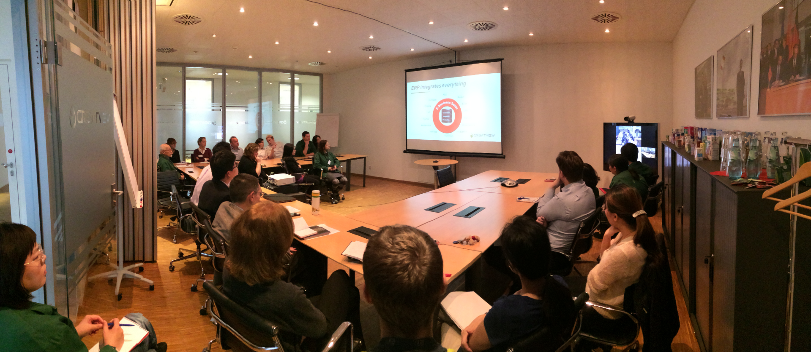
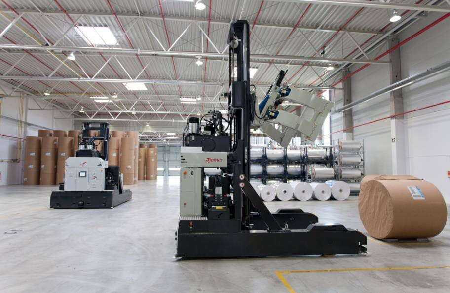
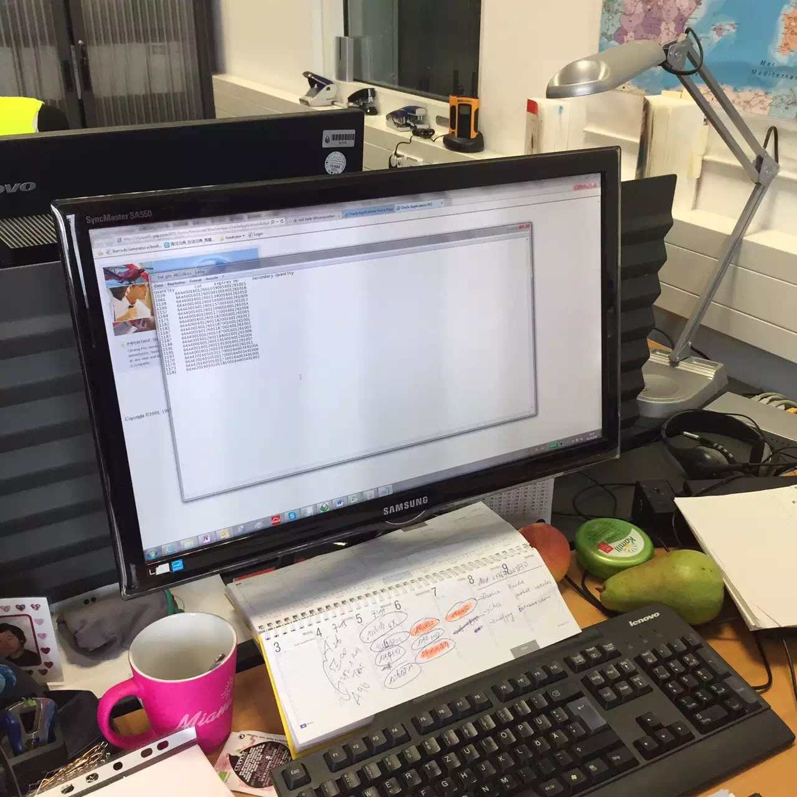
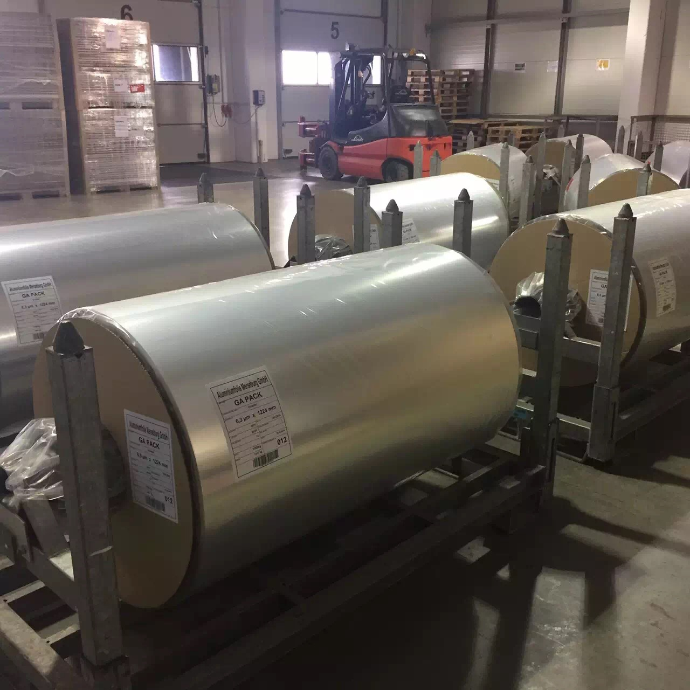

## 纷美包装ERP系统二期海外成功上线运营

2015年集团进一步要求实现纷美集团整体数字化平台搭建， 将全集团国内、国际业务通过Global One Instance承载。2015年11月8日带领实施团队进驻纷美德国工厂，2015年11月10号二期项目正式拉开帷幕。 

与一期不同，欧洲项目实施细节要求更多，自动化程度更高，我们也尝试将一部分工业4.0的概念植入此次实施，例如与MES， AGV系统的集成。并进一步细化管理，采用单卷，单品，半成品，多维度成本核算。

> 2016年10月，纷美包装ERP二期系统正式上线，自此纷美国内、国际生产、运营系统全部打通，集团实现财务业务一体化的精准管理模式，标志着纷美集团全面进入数字化运营阶段，推动纷美全球业务的信息化步伐。
>
> 纷美包装作为一家从中国走出去的跨国公司，ERP二期项目是在跨越文化、语言的环境下，以中国业务为基础延伸至国际业务，这在同行业乃至整个中国制造业都是极少有的。此项目历时仅1年，在一期对国内生产、运营系统标准化、规范化的基础上，二期项目重点将国内、国际各系统和部门的信息打通、标准统一，实现集团国内外信息同步，透明、及时、准确的信息将大幅提升公司决策效率。
>
> 在纷美生产线上建设的MES系统将生产环节的信息准确地导入ERP系统，与其它业务系统的信息紧密串联，将全公司业务整合在一个平台，一个系统，使业务流程、财务流程和管理流程融为一体，加速纷美运营体系的运转效率，提升公司管理水平。
>
> 无论德国工业4.0还是中国制造2025战略，都是旨在提升国家制造业智能化水平的国家竞争策略。纷美集团ERP系统的全面上线不仅是纷美数字化战略的里程碑之一，也使纷美成为中国制造业向中国制造2025迈进的先锋实践者。

