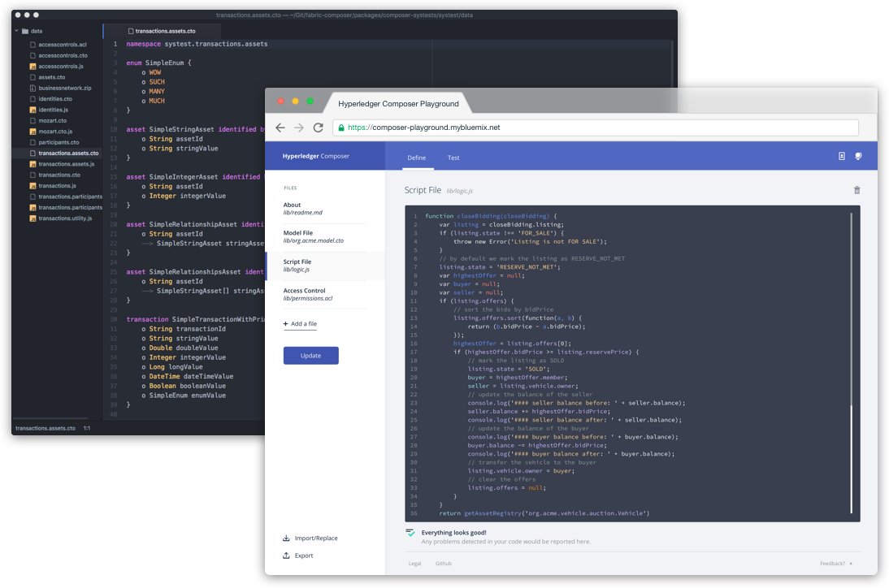
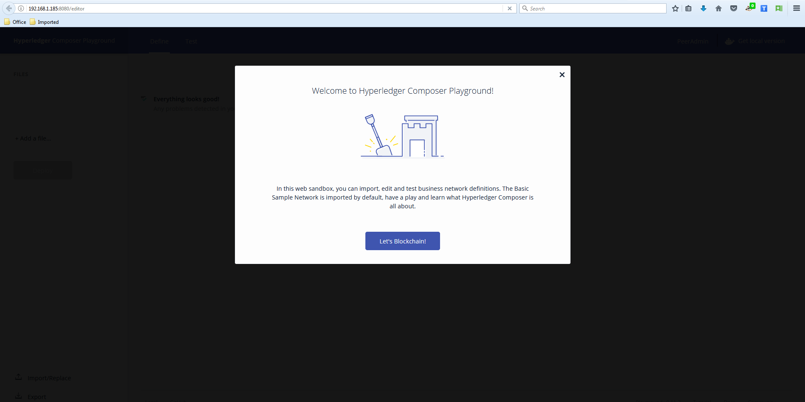
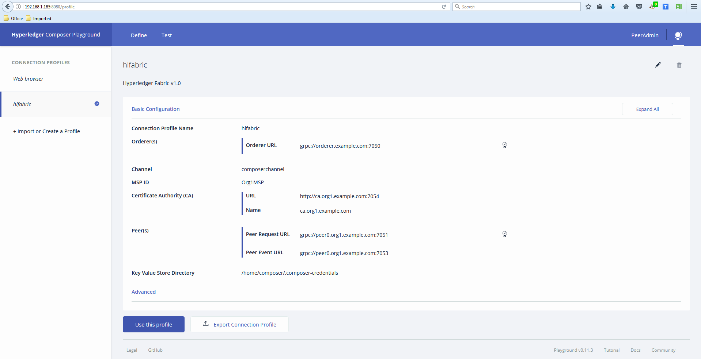
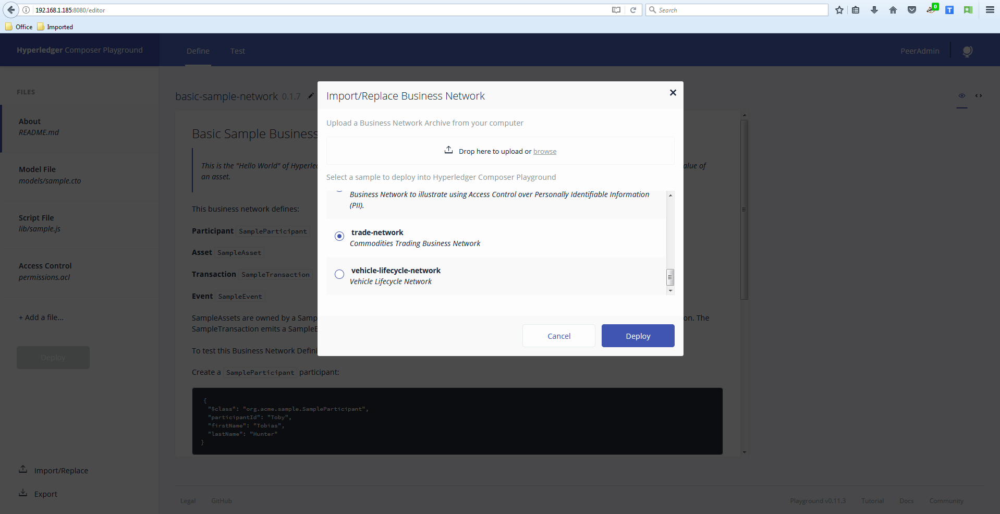
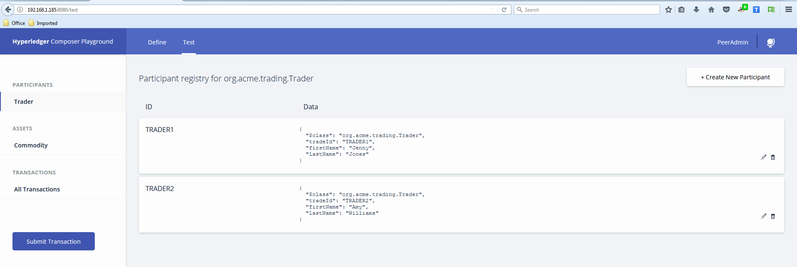
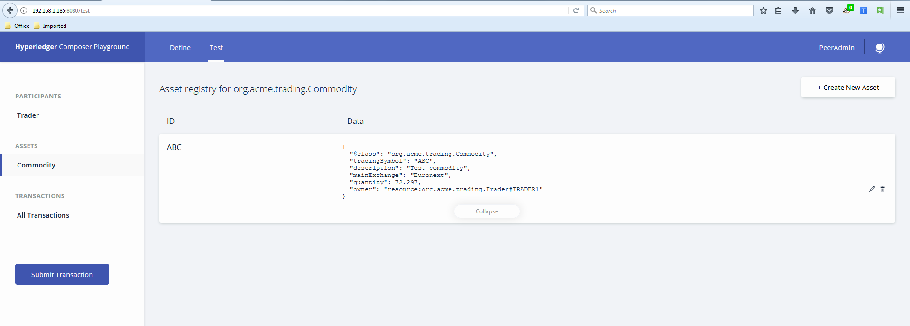
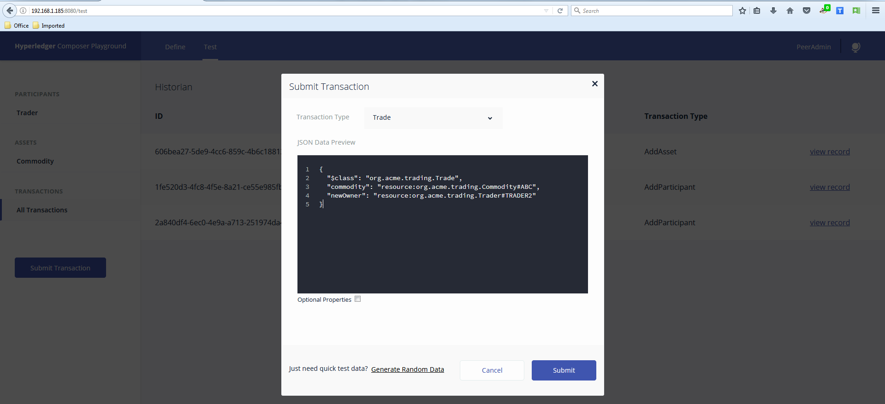
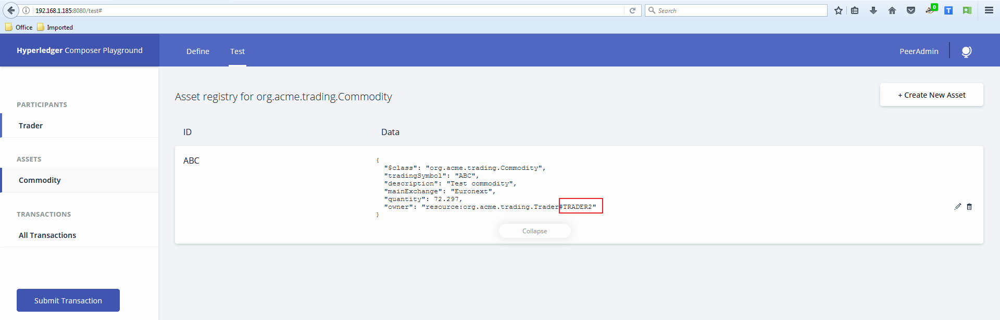

## 本文将带您了解如何在本地机器上安装和运行Hyperledger Composer Playground ，并创建一个Hyperledger Fabric v1.0的实例进行商品交易

不动手试试总感觉对这个东西的理解只停留在概念和一堆名词上，周末找时间本地搭建了一个超级账本网络配以Hyperledger Composer Playground进行测试，有兴趣的可以耐着性子往下看。



### 开始前

为了安装Hyperledger Composer Playground，你需要安装以下软件:

- Docker Engine 17.03 or greater
- Docker Compose 1.8 or greater

请注意: 如果你以前在本机有Hyperledger Composer Playground及Hyperledger Fabric就需要注意，如果你希望从干净环境重新开始，那么下面的命令将删除任何运行的Docker容器并删除所有下载的Docker镜像

> (如果在你的机器上使用其他的Docker镜像的话，一定要小心):

```
docker ps -aq | xargs docker rm -f
docker images -aq | xargs docker rmi -f
```

要跑Hyperledger Composer and Hyperledger Fabric,建议最少4G内存，严重建议至少8G.

### 创建容器以及安装Composer playground

1. 找一个目录(例如：/u01/hypercomposer)，然后运行下面的命令来下载并启动一个Hyperledger Fabric 实例和Hyperledger Composer Playground:

2. ```shell
   curl -sSL https://hyperledger.github.io/composer/install-hlfv1.sh | bash
   ```

3.  然后用Chrome或者Firefox访问 http://<HOSTNAME>:8080 打开 Hyperledger Composer Playground，如果下面这页能打开，并且Connection Profiles也可以正常连接的话，恭喜你，基本的测试环境搭建好了。

   



### 测试案例一

我们直接采用Hyperledger Composer自带的测试场景 Commodities Trading Business Network



Trade Network, This Business Network illustrates commodity trading. This business network defines:

**Participant**
`Trader`

**Asset**
`Commodity`

**Transaction(s)**
`Transaction`
**Event**
`TradeNotification`

models/trading.cto  

```
/**
 * Commodity trading network
 */
namespace org.acme.trading

asset Commodity identified by tradingSymbol {
    o String tradingSymbol
    o String description
    o String mainExchange
    o Double quantity
    --> Trader owner
}

participant Trader identified by tradeId {
    o String tradeId
    o String firstName
    o String lastName
}

transaction Trade {
    --> Commodity commodity
    --> Trader newOwner
}

event TradeNotification {
    --> Commodity commodity
}

transaction RemoveHighQuantityCommodities {
}

event RemoveNotification {
    --> Commodity commodity
}
```

lib/logic.js

```
/*
 * Licensed under the Apache License, Version 2.0 (the "License");
 * you may not use this file except in compliance with the License.
 * You may obtain a copy of the License at
 *
 * http://www.apache.org/licenses/LICENSE-2.0
 *
 * Unless required by applicable law or agreed to in writing, software
 * distributed under the License is distributed on an "AS IS" BASIS,
 * WITHOUT WARRANTIES OR CONDITIONS OF ANY KIND, either express or implied.
 * See the License for the specific language governing permissions and
 * limitations under the License.
 */

/**
 * Track the trade of a commodity from one trader to another
 * @param {org.acme.trading.Trade} trade - the trade to be processed
 * @transaction
 */
function tradeCommodity(trade) {

    // set the new owner of the commodity
    trade.commodity.owner = trade.newOwner;
    return getAssetRegistry('org.acme.trading.Commodity')
        .then(function (assetRegistry) {

            // emit a notification that a trade has occurred
            var tradeNotification = getFactory().newEvent('org.acme.trading', 'TradeNotification');
            tradeNotification.commodity = trade.commodity;
            emit(tradeNotification);

            // persist the state of the commodity
            return assetRegistry.update(trade.commodity);
        });
}

/**
 * Remove all high volume commodities
 * @param {org.acme.trading.RemoveHighQuantityCommodities} remove - the remove to be processed
 * @transaction
 */
function removeHighQuantityCommodities(remove) {

    return getAssetRegistry('org.acme.trading.Commodity')
        .then(function (assetRegistry) {
            return query('selectCommoditiesWithHighQuantity')
                    .then(function (results) {

                        var promises = [];

                        for (var n = 0; n < results.length; n++) {
                            var trade = results[n];

                            // emit a notification that a trade was removed
                            var removeNotification = getFactory().newEvent('org.acme.trading', 'RemoveNotification');
                            removeNotification.commodity = trade;
                            emit(removeNotification);

                            // remove the commodity
                            promises.push(assetRegistry.remove(trade));
                        }

                        // we have to return all the promises
                        return Promise.all(promises);
                    });
        });
}
```

permissions.acl

```
/**
 * Access control rules for mynetwork
 */
rule Default {
    description: "Allow all participants access to all resources"
    participant: "ANY"
    operation: ALL
    resource: "org.acme.trading.*"
    action: ALLOW
}

rule SystemACL {
  description:  "System ACL to permit all access"
  participant: "org.hyperledger.composer.system.Participant"
  operation: ALL
  resource: "org.hyperledger.composer.system.**"
  action: ALLOW
}
```

queries.qry

```
query selectCommodities {
  description: "Select all commodities"
  statement:
      SELECT org.acme.trading.Commodity
}

query selectCommoditiesByExchange {
  description: "Select all commodities based on their main exchange"
  statement:
      SELECT org.acme.trading.Commodity
          WHERE (mainExchange==_$exchange)
}

query selectCommoditiesByOwner {
  description: "Select all commodities based on their owner"
  statement:
      SELECT org.acme.trading.Commodity
          WHERE (owner == _$owner)
}

query selectCommoditiesWithHighQuantity {
  description: "Select commodities based on quantity"
  statement:
      SELECT org.acme.trading.Commodity
          WHERE (quantity > 60)
}
```

To test this Business Network Definition in the **Test** tab:

先定义两个买卖参与者 Trader1和Trader2，Create two `Trader` participants:

```
{
  "$class": "org.acme.trading.Trader",
  "tradeId": "TRADER1",
  "firstName": "Jenny",
  "lastName": "Jones"
}
```

```
{
  "$class": "org.acme.trading.Trader",
  "tradeId": "TRADER2",
  "firstName": "Amy",
  "lastName": "Williams"
}
```


再创建一个商品资产 `Create a `Commodity` asset:

```
{
  "$class": "org.acme.trading.Commodity",
  "tradingSymbol": "ABC",
  "description": "Test commodity",
  "mainExchange": "Euronext",
  "quantity": 72.297,
  "owner": "resource:org.acme.trading.Trader#TRADER1"
}
```


提交一个交易事务处理，也就是把商品ABC从Trader1卖给了Trader2, 也就是更换所有者从Trader到Trader2 `Submit a `Trade` transaction:

```
{
  "$class": "org.acme.trading.Trade",
  "commodity": "resource:org.acme.trading.Commodity#ABC",
  "newOwner": "resource:org.acme.trading.Trader#TRADER2"
}
```



After submitting this transaction, you should now see  the transaction in the transaction registry. As a result, the owner of  the commodity `ABC` should now be owned `TRADER2` in the Asset Registry.

提交此事务后，现在应该在事务注册表中可以看到事务。此时商品ABC的所有者在资产注册表中应该变成TRADER2。



看到这里，很多人会解决这是什么呀， 不就改了一个字段值吗？ 这有什么高深莫测的！！其实我们需要明白的是这个字段变化后面整个区块链网络上发生的事情，这部分比较复杂，推荐大家看原文档中两块：

[架构解释]: https://hyperledger-fabric.readthedocs.io/en/latest/arch-deep-dive.html	"Architecture Explained"
[交易流程]: https://hyperledger-fabric.readthedocs.io/en/latest/txflow.html#	"Transaction Flow"

翻译的文档现在有个致命问题是对关键字的翻译不统一， 有些词汇可以看到好几个版本翻译， 所以还是建议大家直接看原文理解。


​        


